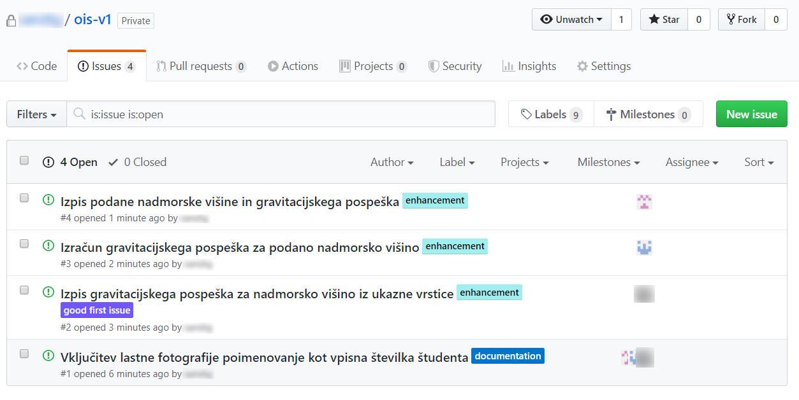
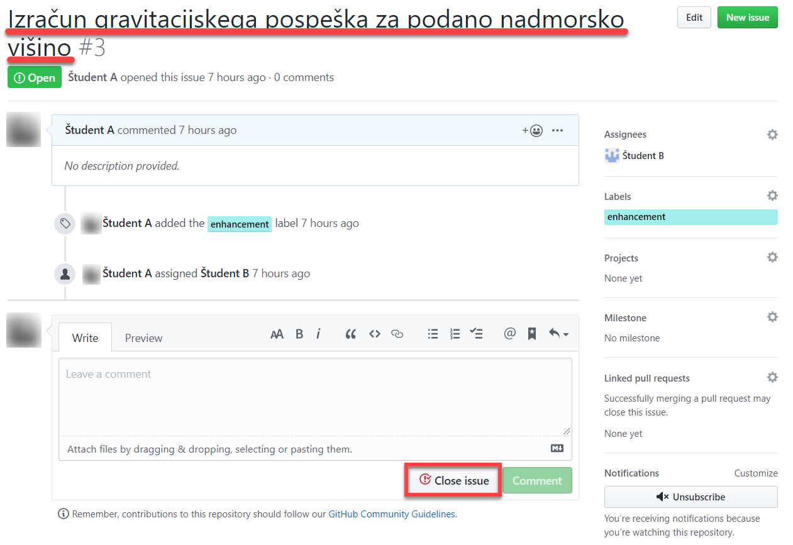

# **V1** Razvoj programske opreme v lokalnem okolju in medsebojno sodelovanje z Git


Za lažje razumevanje vaj si poglejte priprave na vaje iz predavanj [**P1 → V1** Obvladovanje verzij](https://teaching.lavbic.net/OIS/2022-2023/P1-V1.html), odgovore na vprašanja iz teh vaj lahko posredujete v okviru [lekcije **V1**](https://ucilnica.fri.uni-lj.si/mod/quiz/view.php?id=51785) na spletni učilnici.

## 1 Nastavitev delovnega okolja

V okviru opravljanja obveznosti pri predmetu bomo uporabljali sistem za obvladovanje verzij (oz. repozitorij) [GitHub](https://github.com/) ter poljubno lokalno razvojno okolje. Pri razvoju lahko uporabljate poljubno lokalno razvojno okolje, v okviru vaj bomo uporabljali [JetBrains WebStorm](https://www.jetbrains.com/webstorm), v okviru predavanja pa [Visual Studio Code](https://code.visualstudio.com/).

### 1.1 GitHub registracija

Za delo pri predmetu si je treba **ustvariti** lastni uporabniški račun za GitHub repozitorij. Ko uspešno kreirate GitHub uporabniško ime, ga posredujte preko [spletnega obrazca](https://forms.gle/6d1G4pMjrQCzwMR36), saj boste z omenjenimi podatki pridobili dostop do izvorne kode pri predmetu, uporabljali pa se bodo tudi pri vrednotenju vaših sprotnih obveznosti in pisnega izpita pri predmetu.

### 1.2 Nastavitve sistema git

Na vaš sistem najprej namestite orodje za verzioniranje [Git](https://git-scm.com/). Pravilnost nameščenega sistema git preverite z ukazom v ukazni vrstici `git --version`, kjer se vam kot odgovor izpiše nameščena različica Git sistema, kot je predstavljen primer ukazne vrstice na sliki \@ref(fig:slika-v2-WebStorm-pregled).

> **Namig**: Pri operacijskem sistemu _Windows_ se priporoča, da je pot kjer imamo nameščeno _git_ (npr. `C:\Program Files\Git\cmd`) dodana v sistemsko spremenljivko `PATH` in posledično je omogočen dostop do git ukazov povsod preko ukazne vrstice.

V ukazni vrstici vašega lokalnega okolja (npr. `Command prompt` v OS Windows, `terminal` v Linux ali Mac OS), preverite nastavitve sistema git, kjer sta **pomembna** predvsem **uporabniško ime** oz. **ime in priimek** ter **elektronski naslov** avtorja uveljavitev.

Najprej preverite z naslednjima ukazoma, če sta omenjena parametra nastavljena.

```bash
git config --global user.name
git config --global user.email
```

V primeru da nista, jih nastavite s spodnjima ukazoma, kjer so podatki o imenu in priimku ali uporabniškem imenu ter elektronskem naslovu skladni z GitHub uporabniškim računom.

```bash
git config --global user.name "uporabniskoime"
git config --global user.email "sifra@student.uni-lj.si"
```

Pravilne nastavitve se odražajo nedvoumno prikazanemu avtorju uveljavitve. Primer nepravilnih nastavitev git se odraža v tem, da GitHub repozitorij neustrezno poveže vaš [GitHub uporabniški račun](https://help.github.com/en/github/committing-changes-to-your-project/why-are-my-commits-linked-to-the-wrong-user), kar se odraža v nevidnosti avtorja v zavihku repozitorija `contributors` in neznanem uporabniku. Primer neveljavne in veljavne uveljavitve prikazuje naslednja slika.

<p align="center">
  <br>
  <i>Primer uveljavitev v GitHub repozitoriju: na levi strani je primer neveljavne uveljavitve, na desni strani pa veljavne uveljavitve kjer je avtor nedvoumen.</i>
</p>

### 1.3 Vzpostavitev lokalnega razvojnega okolja JetBrains WebStorm

Študenti FRI imajo na voljo študentsko licenco, ki jo pridobijo na [spletnem mestu](https://www.jetbrains.com/student/). Za pridobitev licence je potrebno najprej izpolniti vnosno formo, ki se odpre ob kliku na gumb **Apply now** v kategoriji _Individual licenses for students and teachers_. V vnosni formi navedete osnovne informacije (npr. študentski elektronski naslov). Po potrditvi vnosne forme boste v študentsko elektronsko pošto prejeli nadaljnja navodila za registracijo v spletnem portalu JetBrains ter pridobitev JetBrains licenc, med drugimi tudi za razvojno okolje spletnih aplikacij WebStorm.

Glede na vaš operacijski sistem si nato namestite ustrezno različico orodja [WebStorm](https://www.jetbrains.com/webstorm/download) ter ob prvem zagonu orodja uporabite vašo študentsko licenco.

Primer osnovnih gradnikov razvojnega okolje WebStorm so prikazane na spodnji sliki.

<p align="center">
  <br>
  <i>Osnovni gradniki JetBrains WebStorm lokalnega razvojnega okolja</i>
</p>

## 2 Razdelitev v skupine

Za izvedbo vaje se razdelite v skupine po tri študente in si razdelite naslednje naloge:

- študent **A** je **vodja projekta**,
- študent **B** je **razvijalec zalednega dela sistema** _(angl. backend)_ in
- študent **C** je **razvijalec uporabniškega vmesnika** _(angl. frontend)_.

> **Opomba**: Nalogo lahko seveda simulirate tudi sami, kjer nastopate v vseh treh vlogah, vendar je priporočljivo, da pri izvedbi vaje sodelujete s sošolci.

## 3 Naloga — Gravitacija

Študenti **A**, **B** in **C** naj skupaj razvijejo Java razred `Gravitacija.java` ali Python skripto `gravitacija.py`, ki izračuna in izpiše gravitacijski pospešek za nadmorsko višino, podano preko ukazne vrstice. Pri tem uporabite [Newtonov gravitacijski zakon](https://en.wikipedia.org/wiki/Newton%27s_law_of_universal_gravitation) $F=C\frac{mM}{R^2}=C\frac{mM}{(r+v)^2}=ma$, kjer je $a=\frac{CM}{(r+v)^2}$ gravitacijski pospešek, $C = 6.674 \times 10^{-11}$ gravitacijska konstanta, $M=5.972 \times 10^{24}$ masa zemlje, $r=6.371 \times 10^6$ polmer zemlje in $v$ nadmorska višina v metrih.

Študent **A** bo najprej ustvaril prvotni razred ali skripto, nato pa vsem trem študentom dodelil opravila _(angl. issue)_, ki bodo predstavljala navodila, kaj mora posamezen član ekipe narediti.

### 3.1 Korak 1

Študent **A** na GitHub ustvari prazen **privatni** git repozitorij `ois-v1` (glej spodnjo sliko).

<p align="center">
  <br>
  <i>Kreiranje novega repozitorija</i>
</p>

### 3.2 Korak 2

Študent **A** doda študenta **B** in **C** (glej spodnjo sliko) kot sodelujoča razvijalca GitHub repozitorija (_Settings &rarr; Collaborators &rarr; Manage access_).

<p align="center">
  <br>
  <i>Dodajanje pravic ostalim uporabnikom</i>
</p>

### 3.3 Korak 3

Vsi študenti (**A**, **B** in **C**) si na GitHub ogledajo zavihke **Code** (izvorna koda projekta), **Issues** (opravila, dodeljena članom projekta), **Pull requests** (pregled stanja na različnih vejah), **Actions** (upravljanje z različnimi programskimi jeziki in ogrodji), **Projects** (organizacijsko upravljanje projekta), **Security** (varnostne nastavitve), **Insights** (statistični pregled repozitorija) in **Settings** (nastavitve na nivoju repozitorija).

Po prvi uveljavitvi imate na voljo tudi dodatni meni pri izbranem zavihku **Code**, in sicer zavihke: **commits** (seznam uveljavitev in vej), **branch** (pregled vej), **packages** (gradnja in deljenje knjižnic med repozitoriji) in **releases** (zgrajene programske različice iz izvorne kode repozitorija).

> **Opomba**: Trenuten repozitorij je še vedno prazen, saj študent A še ni dodal nobenih datotek.

### 3.4 Korak 4

V ukazni vrstici si vsi študenti (**A**, **B** in **C**) kreirate novo mapo `v1` in se v to mapo tudi prestavite. Če je bila akcija uspešno izvedena, boste med datotekami v vašem delovnem okolju opazili novo mapo `v1`, ki je podmapa obstoječe mape projekta `ois` (glej primer na spodnji sliki).

<p align="center">
  <br>
  <i>Primer rezultata kreiranja nove mape</i>
</p>

### 3.5 Korak 5

Vsi študenti (**A**, **B** in **C**) v mapi `v1` [ustvarite nov git repozitorij](http://kbroman.org/github_tutorial/pages/init.html) (`git init`) in ga [povežite z GitHub repozitorijem](https://help.github.com/articles/adding-a-remote/) (`git remote add origin`) študenta **A**. Na koncu preverite še status (`git status`) ravno kreiranega repozitorija.

Študent **A** mora vsem članom sporočiti lokacijo, na kateri se nahaja njegov repozitorij, ki je v naslednji obliki:

```text
https://github.com/{lastnik-repozitorija}/ois-v1.git
```

oz.

```text
git@github.com:{lastnik-repozitorija}/ois-v1.git
```

Pri povezovanju mape `v1` z oddaljenim git repozitorijem je potrebno dodati povezavo na zgornjo lokacijo in vključiti vaše GitHub uporabniško ime v naslednji obliki:

```text
https://github.com/{lastnik-repozitorija}/ois-v1.git
```

Povezave za posamezne uporabnike so naslednje:

```text
https://github.com/student-a/ois-v1.git    // Študent A dostopa do svojega lastnega repozitorija
https://github.com/student-a/ois-v1.git    // Študent B dostopa do repozitorija študenta A
https://github.com/student-a/ois-v1.git    // Študent C dostopa do repozitorija študenta A
```

> **Opomba**: V primeru uporabe prenosnega sloja `https` boste morali kreirati [osebni žeton za dostop](https://docs.github.com/en/authentication/keeping-your-account-and-data-secure/creating-a-personal-access-token) _(angl. Personal Access Token)_. Če želite uporabiti prenosni sloj `ssh` namesto `https` (kot je prikazano v zgornjem primeru), si morate ustvariti javni ključ -- glej [navodila](https://help.github.com/en/github/authenticating-to-github/connecting-to-github-with-ssh).

### 3.6 Korak 6

Študent **A** v lokalnem okolju, znotraj mape `v1`, ustvari Java razred `Gravitacija.java` ali Python skripto `gravitacija.py`, ki na zaslon izpiše sporočilo `OIS je zakon!`.

> **Namig**: V primeru uporabe Windows OS je potrebno namestiti podporo za [prevajanje Java programov](https://www.oracle.com/java/technologies/javase-jdk15-downloads.html). V primeru uporabe Unix OS (Linux ali Mac) v lokalnem okolju ni podpore za prevajanje Java programov in če želite razvijati v tem programskem jeziku, potem lahko izvedete naslednja ukaza:

```bash
sudo apt-get update
sudo apt-get install default-jdk
```

### 3.7 Korak 7

Študent **A** najprej **preveri status** svojega lokalnega repozitorija (`git status`), nato pa ustvarjen razred ali skripto **doda** v delovno kopijo (`git add ...`), **uveljavi spremembe** v lokalnem repozitoriju (`git commit -m ...`) ter jih **objavi** v oddaljenem GitHub repozitoriju (`git push origin main`).

> V primeru napake `failed to push some refs to 'https://github.com ...` ustvarite novo vejo main z ukazom `git checkout -b main`.

### 3.8 Korak 8

Študenti **A**, **B** in **C** si na GitHub ogledajo repozitorij študenta **A** (zavihki _Code_, _commit(s)_ in _branch_) (glej spodnjo sliko).

<p align="center">
  <br>
  <i>Podrobnosti uveljavitev</i>
</p>

### 3.9 Korak 9

Študent **A** na GitHub (zavihek _Issues_, gumb _New issue_) vsakemu od študentov (**A**, **B** in **C**) dodeli naslednja opravila (glej 2. spodnjo sliko):

- vključitev lastne fotografije, poimenovane kot vpisna številka (študenti **A**, **B** in **C**) (glej 1. spodnjo sliko),
- izpis gravitacijskega pospeška za nadmorsko višino iz ukazne vrstice (študent **A**),
- izračun gravitacijskega pospeška za podano nadmorsko višino (študent **B**) in
- izpis podane nadmorske višine in gravitacijskega pospeška (študent **C**).

<p align="center">
  <br>
  <i>Primer dodajanja novega opravila in dodelitev študentu A</i>
</p>

<p align="center">
  <br>
  <i>Seznam vseh opravil v okviru projekta</i>
</p>

### 3.10 Korak 10

Študenta **B** in **C** posodobita svoja lokalna repozitorija s stanjem GitHub repozitorija (`git pull ...`).

Spodaj je prikazan primer pridobivanja sprememb oddaljenega repozitorija na privzeti veji _main_ za uporabnika `student-b`. Potem uporabnik v lokalnem repozitoriju kreira novo vejo razvoja `ime-veje`, ki jo nato uveljavi tudi v oddaljen repozitorij.

```bash
~/ois-v1 (main) $ git pull origin main
Password for 'https://github.com/student-a/ois-v1.git':
From https://github.com/student-a/ois-v1
  * branch            main     -> FETCH_HEAD
Already up to date.

~/ois-v1 (main) $ git checkout -b ime-veje
Switched to a new branch 'ime-veje'

~/ois-v1 (ime-veje) $ git status
On branch ime-veje
nothing to commit, working tree clean

~/ois-v1 (ime-veje) $ git push origin ime-veje
Password for 'https://github.com/student-a/ois-v1.git':
Total 0 (delta 0), reused 0 (delta 0)
remote:
remote: Create a pull request for 'ime-veje' on GitHub by visiting:
remote:      https://github.com/student-a/ois-v1/pull/new/ime-veje
remote:
To https://github.com/student-a/ois-v1.git
  * [new branch]      ime-veje -> ime-veje
```

### 3.11 Korak 11

(**vzporedno**) Študent **B** v novi veji `izracun` razredu `Gravitacija.java` ali skripti `gravitacija.py` doda funkcijo, ki za podano nadmorsko višino izračuna gravitacijski pospešek, spremembe skupaj z lastno fotografijo objavi v GitHub repozitoriju ter označi svoja opravila kot rešena (glej spodnjo sliko za eno izmed opravil).

Po uspešni spremembi je v lokalnem repozitoriju stanje, ki je prikazano spodaj (tj. `git status` ukaz nam vrne stanje delovne kopije, kjer je zaznana sprememba datoteke `Gravitacija.java` (oz. `gravitacija.py`) in dodana nova datoteka `b1234567.jpg`, ki predstavlja sliko razvijalca). Sedaj je treba spremembe uveljaviti in jih posredovati v oddaljen repozitorij, da bodo vidne tudi ostalim razvijalcem. Pri ukazu `git commit` je smiselno v sporočilu navesti tudi referenco na nalogo, ki jo opravljamo, npr. pri nalogi za izračun gravitacije z enoličnim identifikatorjem `#3` referenco na nalogo podamo v sporočilu z ukazom `git commit -m "Dodaj izračun pospeška"` pri čemer lahko navedete tudi enolični identifikator naloge s predpono `#` ter številko naloge (npr. `#3`).

> **Namig**: Za kreiranje nove veje in hkrati prestavitev v to novo vejo razvoja lahko uporabimo ukaz `git checkout -b {ime-veje}`.

> **Opomba**: Pri posredovanju sprememb lokalnega repozitorija v oddaljen repozitorij na GitHub bodite pozorni, da posredujete spremembe iz lokalne veje `izracun` v oddaljeno vejo `izracun`.

```bash
studentb:~/ois-v1 (izracun) $ git status
On branch izracun
Changes not staged for commit:
  (use "git add <file>..." to update what will be committed)
  (use "git checkout -- <file>..." to discard changes in working directory)

        modified:   Gravitacija.java

Untracked files:
  (use "git add <file>..." to include in what will be committed)

        b1234567.jpg

no changes added to commit (use "git add" and/or "git commit -a")
```

<p align="center">
  <br>
  <i>Opravilo označimo kot opravljeno</i>
</p>

### 3.12 Korak 12

(**vzporedno**) Študent **C** v novi veji `izpis` razredu `Gravitacija.java` ali skripti `gravitacija.py` doda funkcijo, ki izpiše podano nadmorsko višino in gravitacijski pospešek, spremembe skupaj z lastno fotografijo objavi v GitHub repozitoriju ter označi svoja opravila kot rešena.

> **Opomba**: Izpis iz konzole in zaslonska slika iz prejšnje točke veljajo tudi za to točko.

### 3.13 Korak 13

Vsi študenti (**A**, **B** in **C**) si na GitHub ogledajo repozitorij študenta **A** (zavihek _Code_, podzavihki _commit(s)_, _branches_), kjer je pričakovano stanje prikazano na sliki \@ref(fig:slika-v1-Commits-veje). V plačljivi GitHub različici PRO je mogoč tudi grafični pregled vej v zavihku _Insights_, v izbirnem meniju [_Network_](https://help.github.com/en/github/visualizing-repository-data-with-graphs/viewing-a-repositorys-network).

<p align="center">
  <br>
  <i>Veje razvoja za posamezne študente</i>
</p>

### 3.14 Korak 14

Študent **A** posodobi svoj lokalni repozitorij s stanjem oddaljenega GitHub repozitorija (pridobitev vseh vej in združevanje z `git fetch` in posodobitev lokalne kopije vsake posamezne veje iz oddaljenega repozitorija z `git checkout {ime-veje}`).

### 3.15 Korak 15

Študent **A** v svojem **lokalnem repozitoriju** vejo `izracun` združi z vejo `main` in nato vejo `izracun` izbriše ter spremembe objavi v oddaljenem GitHub repozitoriju. Rezultat združevanja lahko preverimo v GitHub pod zavihkom _Code_ in podzavihkom _commits_. Grafično vizualizacijo uveljavitev na vseh vejah je mogoče preveriti tudi z git ukazom `git log --graph` ali bolj kompaktni vizualizaciji z ukazom `git log --graph --decorate --oneline`.

> **Namig**: Vedno, ko združujemo dve veji, se najprej z ukazom `git checkout veja-a` prestavimo v to vejo (npr. `veja-a`), kjer želimo končni rezultat združevanja in nato zahtevamo združevanje z drugo vejo (npr. `veja-b`) z ukazom `git merge veja-b`.

> **Namig**: Za brisanje lokalne veje (npr. `veja-b`) lahko uporabimo ukaz `git branch -d veja-b`. Poleg tega je smiselno izvesti tudi brisanje veje v oddaljenem repozitoriju z uporabo ukaza `git push origin --delete veja-b`.

### 3.16 Korak 16

Študent **A** v svojem **lokalnem repozitoriju** vejo `izpis` združi z vejo `main` in odpravi konflikte, ki so pri tem nastali, z orodjem `mergetool` ali z urejevalnikom besedila ter izbriše vejo `izpis` in spremembe objavi v oddaljenem GitHub repozitoriju.

Ob poskusu združevanja pride do konflikta, kar je pričakovano, saj poskušamo združevati vsebino datoteke `gravitacija.py` oz. `Gravitacija.java`, kjer je v eni veji dodana metoda za izračun, v drugi pa metoda za izpis. Git sistem se ne more samodejno odločiti, katero spremembo naj obdrži.

Spodaj je prikazan prikaz v Linux konzoli, kjer je tudi pri zahtevi po združevanju (ukaz `git merge`) prikazano to nedoločeno stanje (`main|MERGING`), ki ga moramo razrešiti.

```bash
studenta:~/workspace/v1 (main) $ git merge izpis
Auto-merging gravitacija.py
CONFLICT (content): Merge conflict in gravitacija.py
Automatic merge failed; fix conflicts and then commit the result.
studenta:~/workspace/v1 (main|MERGING) $
```

Najlažje takšen konflikt razrešimo kar z urejevalnikom izvorne kode (glej spodnji izsek kode), kjer se moramo odločiti, katere dele bomo obdržali in kaj bomo odstranili (izseki iz posameznih različic, ki jih želimo združiti, so prikazani med bloki `<<<<<<< HEAD`, `=======` in `>>>>>>> izpis`). V tem primeru je situacija preprosta, saj želimo obdržati vse spremembe, zato zgolj izbrišemo vrstice 1, 4 in 7 ter datoteko shranimo.

`gravitacija.py`

```bash
<<<<<<< HEAD
def gravitacija(visina):
    return ...
=======
def izpis(visina, gravitacija):
    print ...
>>>>>>> izpis

print 'OIS je zakon!'
```

Ko je datoteka shranjena, moramo spremembe dodati v delovno kopijo (`git add ...`), jih uveljaviti v lokalni repozitorij (`git commit -m ...`), izbrisati vejo, iz katere smo združevali (`git branch -d ...`), in vse spremembe posredovati v oddaljen GitHub repozitorij (`git push origin ...`).

### 3.17 Korak 17

Vsi študenti (**A**, **B** in **C**) si na GitHub ogledajo repozitorij študenta **A** (zavihek _Code_, podzavihki _commits_ in _branches_) in kompaktno grafično predstavitvijo stanja uveljavitev na posameznih vejah z `git` ukazom `git log --graph --decorate --oneline`.

```bash
studenta:~/ois-v1 (main) $ git log --graph --decorate --oneline
*   68940ea Odpravi konflikte izračuna in izpisa
|\
| * 595e539 Dodaj izpis pospeška #2
* | 0e19363 Dodaj izračun pospeška #3
|/
* 9fe2ace Začetna verzija repozitorija
```

### 3.18 Korak 18

Študent **A** popravi razred `Gravitacija.java` ali skripto `gravitacija.py` tako, da izpiše gravitacijski pospešek za nadmorsko višino, podano preko ukazne vrstice.

### 3.19 Korak 19

Študent **A** popravljen razred `Gravitacija.java` ali skripto `gravitacija.py` skupaj z lastno fotografijo doda v lokalni repozitorij, objavi v GitHub repozitoriju (glej 1. sliko spodaj) ter označi svoja opravila kot rešena (glej 2. sliko spodaj).

<p align="center">
  <br>
  <i>Končno stanje datotek</i>
</p>

<p align="center">
  <br>
  <i>Vsa opravila morajo biti zaključena</i>
</p>

### 3.20 Korak 20

Študent **A** nastavi repozitorij na javnega.

### 3.21 Korak 21

Skupina prosi enega izmed sošolcev (npr. študenta **D** iz **ne**obstoječih članov ekipe, tj. študent A, študent B oz. študent C) za testiranje razvite rešitve. Študent **D** naj si s pomočjo ukaza `git clone ...` prenese vsebino oddaljenega GitHub repozitorija v svoje lokalno okolje in naj preveri delovanje razreda `Gravitacija.java` ali skripte `gravitacija.py`.
