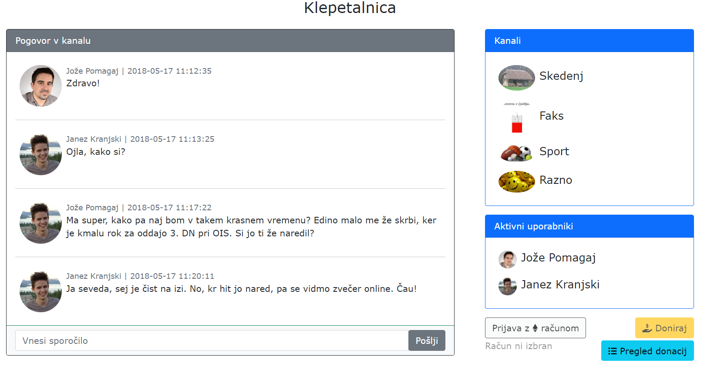
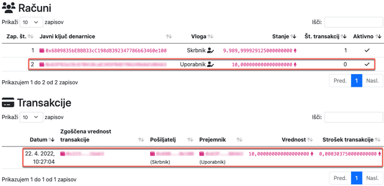

# **V10** Klepetalnica in uvod v tehnologijo veriženja blokov

Odgovore na vprašanja iz teh vaj lahko posredujete v okviru [lekcije **V10**](https://ucilnica.fri.uni-lj.si/mod/quiz/view.php?id=52447) na spletni učilnici.

## Vzpostavitev okolja

Na voljo je odjemalska spletna aplikacija **Klepetalnica**, ki za podporo poglavitnih funkcionalnosti uporablja [**Teaching API**](https://teaching.lavbic.net/api/docs/). V okviru vaj popravite in dopolnite obstoječo implementacijo v datoteki `js/skripta.js`, kot zahtevajo navodila. Med delom smiselno uveljavljajte spremembe v lokalnem in oddaljenem repozitoriju!

> **Opomba**: Za poenostavljeno reševanje naloge so v programski kodi v datoteki `js/skripta.js` na mestih kjer se zahtevajo odgovori podani nizi **`ODGOVOR`** kar posledično na spletni strani prikazuje napake na strani odjemalca. **Nize `ODGOVOR` nadomestite s pravilnimi odgovori oz. rešitvami.**

## Spletna storitev in odjemalec

Odjemalska aplikacija, ki jo boste izdelali v okviru teh vaj, se bo morala povezovati na spletno storitev **Klepetalnica**. Spletna storitev omogoča različne metode, ki so podrobno opisane v dokumentaciji spletne platforme [**Teaching API**](https://teaching.lavbic.net/api/docs/) in omogoča tudi ročno preizkušanje storitev. Pri reševanju vseh nadaljnjih nalog si pomagajte s to dokumentacijo.

V vaši odjemalski aplikaciji vnesite svoje podatke za spremenljivko `uporabnik` v datoteki `js/skripta.js`, kjer za polje `id` uporabite vrednost med **0** in **95**.

`js/skripta.js`

~~~~ {.javascript}
let uporabnik = {id: 66, vzdevek: "Radovedni Matic"}; // TODO: vnesi svoje podatke
~~~~

Nato odprite spletno stran `index.html` in pojaviti bi se vam moralo okno, prikazano na naslednji sliki.

   
    <i>Uporabniški vmesnik spletne klepetalnice</i>

## Pridobivanje pogovorov

Implementirajte funkcijo za pridobivanje pogovorov v datoteki `js/skripta.js`, ki se po uspešni izvedbi samodejno pokliče vsakih 5 sekund. Uporabite enak stil prikazovanja sporočil, kot je že prikazan v datoteki `index.html`.

Lahko tudi pazite na obremenjenost povezave in ob osvežitvah prenašate le nova sporočila.

> **Namig**: Vse podrobnosti o delovanju funkcij spletne storitve najdete v dokumentaciji [**Teaching API**](https://teaching.lavbic.net/api/docs/), kjer jih lahko tudi interaktivno testirate.

## Posodabljanje uporabnikov

Implementirajte funkcijo za posodabljanje uporabnikov v datoteki `js/skripta.js`, ki se po uspešni izvedbi samodejno pokliče vsakih 5 sekund. Uporabite enak stil prikazovanja sporočil, kot je že prikazan v datoteki `index.html`.

## Pošiljanje sporočila

Sedaj lahko v vašem odjemalcu le opazujete, kaj pišejo drugi uporabniki, zato implementirajte funkcijo za pošiljanje sporočil. Sporočilo naj se pošlje ob pritisku na gumb `Pošlji` oz. pritisku na tipko `ENTER` in po uspešni izvedbi naj se polje z vnesenim sporočilom izprazni. V primeru napake izpišite opozorilo (`alert()`) z vsebino opisa napake iz strežnika. Prav tako takoj posodobite sporočila v pogovoru in seznam uporabnikov.

## Menjava kanala

Implementirajte funkcionalnost za menjavo kanala. Pri tem v oknu s sporočili le izbrišite trenutne pogovore, uporabnike in kanal ter ustrezno nastavite globalni spremenljivki `trenutniKanal` in `idNaslednjegaSporocila`.

Bodite tudi pazljivi, da ob zamenjavi seznama sob funkcionalnost menjave sob še vedno deluje! Prav tako poskrbite, da se testna sporočila, ki so trenutno prikazana, izbrišejo in se prikažejo zgolj tista, ki jih pridobite iz strežnika.

> **Namig**: Razmislite, kje bi lahko prišlo do nenavadnega obnašanja vašega odjemalca.

## Dostop do verige blokov in kreiranje novega računa

Na spletnem naslovu [https://**sensei**.lavbic.net](https://sensei.lavbic.net) se nahaja **Ethereum testno omrežje**, ki ga bomo uporabljali pri tem predmetu. Na začetni strani omenjenega spletnega naslova se nahaja preprost **pregledovalnik računov in transakcij na verigi blokov**, ki vam omogoča pregled računov, vključno s pripadajočimi transakcijami in stanjem na računu ter tudi pregled podrobnosti posameznih transakcij s podatki o pošiljatelju, prejemniku, vrednosti in strošku transakcije.

   
    <i>Kreiranje novega računa</i>

Na tej strani so na voljo tudi operacije, ki jih lahko izvajate na verigi blokov, in sicer boste uporabili javno operacijo **kreiranja novega računa** (glej naslednjo sliko), kjer si izberete poljubno **geslo** (dolžine vsaj 10 znakov) in sistem vam zgenerira nov račun ter vam kot odgovor vrne **javni ključ vašega računa** (glej naslednjo sliko), ki si ga obvezno zabeležite.

   
    <i>Potrditev kreiranja novega računa</i>

Nov račun se pojavi tudi **na seznamu računov** (glej naslednjo sliko), kjer je **prikazan z javnim ključem** oz. naslovom vaše denarnice, kamor vam lahko ostali uporabniki tudi prenesejo sredstva. S pomočjo vašega gesla pa imate nadzor nad tem računom le vi. Ob kreiranju računa je seveda le-ta **prazen** (stanje je 0 ETH).

   
    <i>Nov račun na seznamu računov</i>

## Pridobitev začetnih sredstev

Začetna sredstva na [Ethereum testnem omrežju](https://sensei.lavbic.net) lahko zahteva vsak študent pri predmetu **zgolj 1x**, in sicer s pomočjo klica REST API metode [**`/OIS/BC/registracija`**](https://teaching.lavbic.net/api/docs/#/OIS/get_OIS_BC_registracija), ki je na voljo na strežniku [Teaching API](https://teaching.lavbic.net/api/docs).

Kot prikazuje naslednja slika je treba v okviru registracije računa in začetnega prenosa sredstev podati 3 zahtevane parametre - **naslov računa** (generiranega v prejšnjem koraku) in **GitHub uporabniško ime** ter **vpisno številko**.

   
    <i>Registracija in zahteva za prenos sredstev</i>

Če bo operacija uspešna, se bo na vaš račun preneslo **10 ETH**, kar boste lahko uporabili pri izvedbi vaje _V10_ in _2. dela DN_. To lahko tudi preverite neposredno na verigi blokov [Ethereum testno omrežje](https://sensei.lavbic.net) (glej naslednjo sliko), kjer med računi poiščite svojega ter preverite ali je stanje enako 10 ETH. Prav tako pa lahko med transakcijami poiščete omenjeno transakcijo prenosa teh sredstev s strani skrbniškega računa na vaš račun, kjer je na voljo vrednost in strošek transakcije (glej naslednjo sliko).

   
    <i>Potrjen prenos sredstev</i>

## Prijava uporabnika v račun

Po uspešni pripravi računa ter pridobitvi sredstev se osredotočimo na implementacijo funkcionalnosti tehnologije veriženja blokov Ethereum omrežja. Za interakcijo z verigo blokov bomo uporabili knjižnico [web3.js](https://web3js.readthedocs.io/en/v1.9.0/index.html) različica **1.9.0**.

Za pošiljanje sredstev iz lastnega računa je potrebno najprej pripraviti dostop oz. prijavo uporabnika na lasten račun. Delovanje je podobno kot običajna prijava, kjer kot enolični identifikator prijave (npr. elektronski naslov, unikatno uporabniško ime, davčna številka, vpisna številka itd.) uporabimo **naslov** našega Ethereum računa, ki se začne z znakoma `0x`, je dolžine 42 znakov, kjer so preostali znaki črke a, b, c, d, e, f in števila (npr. naslov skrbnika `0x6809835bEBBB33cC198dB392347786b63460e100`) kot prikazuje naslednja slika.

   
    <i>Modalno okno za prijavo Ethereum računa</i>

Prijava bo potekala s pomočjo [modalnega okna ogrodja Bootstrap](https://getbootstrap.com/docs/5.0/components/modal/), kjer je treba ustrezno uporabiti _web3.js_ funkcijo [`unlockAccount`](https://web3js.readthedocs.io/en/v1.9.0/web3-eth-personal.html#unlockaccount).

> **Namig**: Čas trajanja prijave je opredeljen v datoteki `js/skripta.js` ob uspešni prijavi računa.

## Izvajanje transakcij

Implementirajte izvajanje transakcije prijavljenih uporabnikov. Funkcionalnost naj bo na voljo ob kliku na gumb **Doniraj**, kjer je treba uporabiti _web3.js_ funkcijo [`sendTransaction`](https://web3js.readthedocs.io/en/v1.9.0/web3-eth.html#sendtransaction) (glej naslednjo sliko).

Enostavno transakcijo je mogoče izvesti s sledečimi parametri:

* pošiljatelj (parameter `from`),
* prejemnik (parameter `to`) in
* količina (parameter `value`).

Vsaka _Ethereum_ (ETH) enota (1 ETH) je na verigi blokov deljiva na 18 decimalnih mest, kjer so enote v predstavljene v celoštevilski obliki. Zato je potrebno vsako enoto množiti s 1018, npr. `1 * Math.pow(10, 18)`.

   
    <i>Primer modalnega okna za donacijo sredstev</i>

## Pregled transakcij

Trenutna rešitev omogoča ob kliku na gumb **Pregled donacij** prikaz števila donacij (transakcij). Dopolnite implementacijo, da se bodo izpisovali podatki o pošiljatelju, prejemniku in količini donacije, ki jih pridobite z uporabo _web3.js_ funkcije [`getTransaction`](https://web3js.readthedocs.io/en/v1.9.0/web3-eth.html#gettransaction). V primeru, ko je račun prijavljen, omejite prikaz donacij tako, da bodo razvidne le tiste donacije, ki vsebujejo prijavljen račun kot pošiljatelja transakcije (glej naslednjo sliko).

   
    <i>Primer prikaza donacij prijavljenega računa</i>

