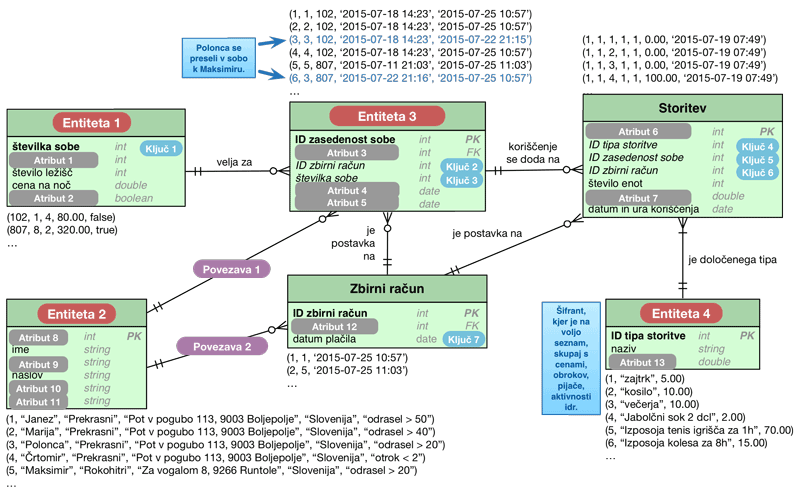
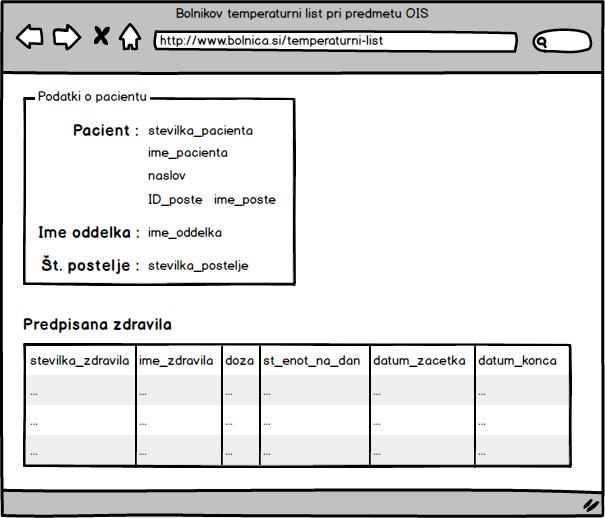

# **V7** ER načrtovanje in normalizacija

Za lažje razumevanje vaj si poglejte predavanja P8 [Strukturni razvoj](https://teaching.lavbic.net/OIS/2022-2023/P8.html), odgovore na vprašanja iz teh vaj lahko posredujete v okviru [lekcije **V7**](https://ucilnica.fri.uni-lj.si/mod/quiz/view.php?id=52282) na spletni učilnici.

## Opis problema

Kot obetajoči študent Fakultete za računalništvo in informatiko se znajdete v **vlogi analitika** in **načrtovalca** manjših delov dveh informacijskih sistemov, ki podpirata **delovanje hotela** in **delovanje bolnišnice**.

Za vas sta pripravljena dva problema, ki sta podrobneje predstavljena v nadaljevanju:
1. v okviru **priprave načrta podatkovenga modela hotela** z entitetno-relacijskim (ER) načrtovanjem boste morali dopolniti obstoječ načrt podatkovnega modela z manjkajočimi elementi, ki so skladni z zahtevami v navodilih in
2. v okviru **normalizacije temperaturnega lista bolnika** boste morali poskrbeti za ustrezno strukturo podatkov v podatkovni bazi v zvezi z zdravili, ki jih pacientu predpiše zdravnik.

## Priprava načrta podatkovnega modela hotela

### Navodila

V manjšem obmorskem kraju ima lastnik manjšega hotela željo ugotoviti, da ste vešči računalništva, ker ste poslušali predmet Osnove informacijskih sistemov. V svojem hotelu ima težave z muhastimi gosti, ki med bivanjem **menjajo sobe**, v katerih prenočujejo. Težava nastane zaradi tega, ker se **vse dodatne storitve obračunavajo na sobo** in je zato potreben podatkovni model, ki to omogoča.

Osnutek podatkovnega modela je na voljo na spodnji sliki. Poleg same sheme so na voljo tudi določeni podatki v obliki relacij, ki so že v podatkovni bazi in odražajo trenutno stanje. Ključna zahteva našega lastnika hotela je, da o gostih hrani zgolj **osnovne podatke** (ime, priimek in naslov), zanima pa ga tudi **tip gosta**, saj želi po tem atributu izvajati določene analize. Določene storitve pa so za **izbran tip gosta tudi brezplačne** (npr. za tip gosta "otrok < 2" velja, da ima v tem hotelu brezplačne obroke ipd.).

V sistem želimo imeti tudi **seznam vseh sob** s podatki o **številki sobe**, na katerem **nadstropju** se nahaja, **koliko ležišč ima** in ali je **del All inclusive paketa** (v tem primeru imajo vsi gosti te sobe brezplačno prehrano in pijačo).

Na voljo je tudi seznam vseh **storitev**, ki jih hotel ponuja. V tem primeru ne želimo preveč generalizirane rešitve, ampak se zadovoljimo zgolj z **enim šifrantom**, kjer so shranjene vse aktivnosti, obroki, pijače idr. - **vse kar lahko gost koristi** v hotelu in mu seveda lahko zaračunamo, zato imamo zraven tudi **podatek o ceni**.

Pri registraciji gostov v hotelu, se le-ta zavede v informacijski sistem tako, da njegovo bivanje povežemo z **zasedenostjo sobe**, t.j. gosta povežemo s sobo in zbirnim računom. V našem primeru, ko v sobi bivajo 4 člani družine Prekrasni, za vsakega zavedemo ta podatek, vključno s tem, kdaj so se prijavili in kdaj so se odjavili iz sobe (ponavadi začetek in konec dopustovanja v hotelu). **Zbirni račun** pa v tem primeru predstavlja vse zaračunane storitve, ki so jih gostje določene sobe v hotelu koristili in plačilo same sobe oz. zasedenost sobe. Torej gostje hotela lahko ob vsakem koriščenju storitve hotela (npr. izposoja kolesa, pijača v baru ipd.) preprosto **predložijo svojo kartico**, kjer je zavedena njihova soba in podatek o tem, kdo so. Pri koriščenju storitev imamo na voljo tudi podatek o **popustu**. Ta podatek se npr. upošteva, ko gost koristi storitev, ki je **že vključena v nočitev v sobi**, ki je del All inclusive paketa (npr. gost gre na zajtrk, ki je že vključen v njegovo nastanitev, zato se v tem primeru v tabeli storitev nastavi atribut popust na 100%).

### Naloga

Dopolnite načrt podatkovnega modela na naslednji sliki in sicer:
* _Entitete 1&#8211;4_,
* _Ključe 1&#8211;7_,
* _Atribute 1&#8211;13_ in
* _Povezavi 1&#8211;2_.

   
    <i>Podatkovni model hotela z manjkajočimi elementi</i>

Na zgornji sliki je prikazan tudi poseben primer **Polonce Prekrasni**, ki se med dopustom zaradi morebitne optimizacije stroškov in drugih razlogov iz sobe svoje družine **preseli v sobo Maksimirja Rokohitrega**. Razlog za to je njeno ljubezensko stanje in finančni vidik, saj ima njen izbranec Maksimir sobo, ki je del **All inclusive** paketa in lahko določene **storitve v hotelu koristi brezplačno**.

Polonca je zelo varčno dekle in na dopustu ni veliko zapravljala. Poleg vode, ki je v hotelu brezplačna in jo je pila ves čas dopusta, si je zgolj **2x privoščila 2 dcl jabolčnega soka v baru**. Prvič je bila prijavljena skupaj z družino v sobi **102** in drugič, ko je bila prijavljena z Maksimirjem v sobi **807** (All inclusive paket, kjer je popust 100, t.j. brezplačno). Dopolnite relaciji v tabeli Storitev, ki prikazujejo zapisane podatke v podatkovni bazi za koriščenje storitve pijače:
* na račun družinske sobe in
* na račun maksimirjeve sobe.

## Normalizacija temperaturnega lista bolnika

### Navodila

Že pred časom ste se z vodstvom bolnišnice pogovarjali o različnih načinih zapisa podatkov v podatkovni bazi za **bolnikov temperaturni list** (t.j. navodila za jemanje zdravil, ki jih bolniku predpiše zdravnik).

Prišli ste do zaključka, da bo za omenjen problem najbolj primerna 3. normalna oblika (3. NO). Zdaj je potrebno upoštevati vse pridobljene podatke in pripraviti **načrt podatkovne baze v obliki relacij** in **logično shemo podatkovne baze**.

   
    <i>Predloga uporabniškega vmesnika bolnikovega temperaturnega lista</i>

Pri pripravi načrta podatkovne baze, poleg **predloge uporabniškega vmesnika** na zgornji sliki, upoštevajte tudi naslednje zahteve:

* pacient lahko v nekem obdobju vzame več zdravil, prav tako lahko vzame isto zdravilo večkrat v različnih obdobjih,
* število enot zdravila na dan (`stevilo_enot_na_dan`) in datum konca jemanja zdravila (`datum_konca`) sta odvisna od dogodka predpisanega jemanja zdravil,
* veljajo pa tudi naslednje funkcionalne odvisnosti:
    * `stevilka_zdravila` &rarr; `opis`
    * `stevilka_pacienta` &rarr; `stevilka_postelje`
    * `stevilka_zdravila` &rarr; `ime_zdravila`
    * `stevilka_pacienta` &rarr; `ID_poste`
    * `stevilka_postelje` &rarr; `stevilka_oddelka`
    * `ID_poste` &rarr; `ime_poste`
    * `stevilka_oddelka` &rarr; `ime_oddelka`
    * `stevilka_kategorije` &rarr; `naziv_kategorije`
    * `stevilka_pacienta` &rarr; `naslov`
    * `stevilka_pacienta` &rarr; `ime_poste`
    * `stevilka_zdravila` &rarr; `doza`
    * `stevilka_zdravila` &rarr; `metoda_zauzitja`
    * `stevilka_pacienta` &rarr; `ime_pacienta`
    * `stevilka_zdravila` &rarr; `stevilka_kategorije`
    * `stevilka_zdravila` &rarr; `naziv_kategorije`
    * `stevilka_pacienta` &rarr; `ime_oddelka`
    * `stevilka_kategorije` &rarr; `metoda_zauzitja`

### Naloga

Pripravite **normalizirano shemo** predstavljenega problema v **3. NO** in jo zapišite v obliki **relacij** in **diagrama z medsebojnimi povezavami**.
