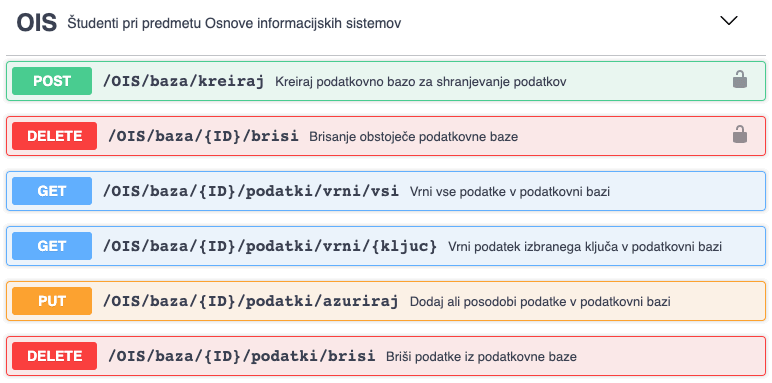
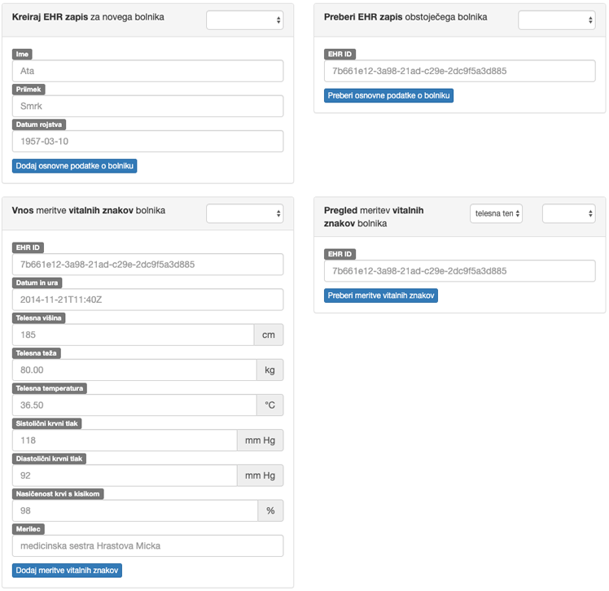

# **V8** Teaching API in uvod v objektni razvoj informacijskih sistemov

Za lažje razumevanje vaj si poglejte predavanja **P10** [Objektni razvoj in simulacija razvoja informacijskega sistema za bankomat](https://teaching.lavbic.net/OIS/2022-2023/P10.html), odgovore na vprašanja iz teh vaj lahko posredujete v okviru [lekcije **V8**](https://ucilnica.fri.uni-lj.si/mod/quiz/view.php?id=52438) na spletni učilnici.

## Uvod

Za 2. del domače naloge [Načrt informacijske rešitve in aplikacija](https://teaching.lavbic.net/OIS/2022-2023/DN.html#DN-nacrt) boste morali implementirati svoj predlog informacijske rešitve domače naloge. Ena izmed zahtev domače naloge je tudi izdelava načrta informacijske rešitve, in sicer po objektnem pristopu.

Delujoča aplikacija pa je na voljo na spletnem naslovu [https://ois-2022-2023.github.io/V8/](https://ois-2022-2023.github.io/V8/), kjer za gostovanje uporabljamo funkcionalnost [**GitHub Pages**](https://pages.github.com/). Gre za brezplačno gostovanje spletnih strani projektov na repozitoriju GitHub, ki je namenjena preprostim dinamičnim spletnim aplikacijam, kjer ne potrebujemo naprednega spletnega strežnika (npr. Node.js, Apache idr.).

## Teaching API

[**Teaching API**](https://teaching.lavbic.net/api/docs/) vključuje **platformo za shranjevanje podatkov** za potrebe _2. dela domače naloge_, ki jo bomo uporabljali v okviru predmeta. Na voljo je implementacija enostavne podatkovne baze, kamor lahko shranjujete podatke v `ključ-vrednost` obliki. Vsak študent pridobi dostop do svojega lastnega prostora, do katerega dostopa preko enoličnega identifikatorja, ki je enak njegovemu GitHub uporabniškemu imenu.

Za potrebe demonstracije in primera v okviru tega testnega primera je na voljo testna podatkovna baza z enoličnim identifikatorjem **`demo`**.

### Swagger UI

Vse funkcionalnosti, ki jih Teaching API strežnik omogoča, so na voljo preko [**Swagger UI**](https://teaching.lavbic.net/api/docs/) uporabniškega vmesnika (glej naslednjo sliko), kjer lahko vsako funkcionalnost tudi testirate preko vgrajenega testnega odjemalca.

   
    <i>Metode Teaching API vmesnika</i>

Dokumentacija je dovolj opisna, da lahko vsako funkcionalnost začnete hitro uporabljati brez potrebnega predznanja. Predvsem koristne so naslednje metode:

* `GET` **`/OIS/baza/{ID}/podatki/vrni/vsi`** vrača vsebino celotne podatkovne baze v obliki JSON dokumenta,
* `GET` **`/OIS/baza/{ID}/podatki/vrni/{kljuc}`** vrača vrednost podanega ključa `{kljuc}` (npr. `ime`), kjer je lahko ključ tudi ugnezden (npr. `oseba|ime`),
* `PUT` **`/OIS/baza/{ID}/podatki/azuriraj`** doda podan JSON dokument in sprejme opcijski parameter `{kljuc}` (shrani podatek v vrednost ključa, sicer v koren dokumenta) in `{elementTabele}` (dodaja podatke kot element tabele ali kot objekt),
* `DELETE` **`/OIS/baza/{ID}/podatki/brisi`** izbriše vsebino podatkovne baze ali vrednost ključa, podanega z opcijskim parametrom `{kljuc}`.

kjer je `{ID}` vaše GitHub uporabniško ime.

## Naloga

### Diagram primerov uporabe

Na podlagi [delujoče testne aplikacije](https://ois-2022-2023.github.io/V8/) in njene izvornne kode, ki jo prikazuje naslednja slika, pripravite diagram primerov uporabe (DPU)!

> Razmislite tudi, kako bi pripravili DPU za vaš predlog aplikacije v okviru DN [Načrt informacijske rešitve in aplikacija](https://teaching.lavbic.net/OIS/2022-2023/DN.html#DN-nacrt)!

   
    <i>Uporabniški vmesnik delujoče testne aplikacije</i>

### VOPC razredni diagram

Namen VOPC (angl. View of Participating Classes (VOPC) oz. razredni diagram sodelujočih razredov) razrednih diagramov je porazdelitev odgovornosti za izvajanje funkcionalnosti predlaganega sistema po posameznih razredih.

Na globalnem VOPC diagramu prikažemo celotno strukturo aplikacije, ki je sestavljena iz naslednjih osrednjih komponent:

* **mejni razred** (angl. boundary) predstavlja vmesnik do našega sistema (npr. uporabniški ali sistemski),
* **kontrolni razred** (angl. control) predstavlja poslovno logiko naše aplikacije,
* **poslovni razred** (angl. entity) predstavlja podatke, ki jih hranimo znotraj našega sistema.

Pri izdelavi **VOPC diagrama** poenostavimo problem in ga pripravimo zgolj do tega obsega, da bo v celoti podpiral naslednja PU-ja:

* **Vnašanje** meritve **vitalnih znakov** bolnika in
* **Pregled** meritev **vitalnih znakov** bolnika.

### Diagram zaporedja

Če želimo programerju predstaviti dovolj informacij za razvoj željene funkcionalnosti, mu moramo, poleg diagrama primerov uporabe (DPU) in VOPC diagrama, pripraviti tudi **diagram zaporedja**.

Vaša naloga je, da za PU-ja "**Vnašanje** meritve **vitalnih znakov** bolnika" in "**Pregled** meritev **vitalnih znakov** bolnika (zgolj za prikaz telesne temperature)" pripravite diagrama zaporedja, ki predstavljata osnovna tokova dogodkov omenjenih primerov uporabe.